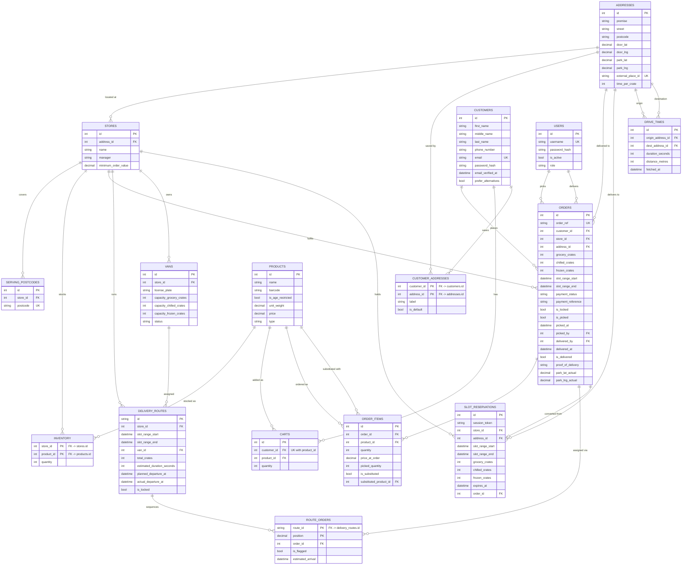

# Store App database

This is a database scheme for my supermarket store project

## Diagram

## Tables
Entire database of the app it handles all the picking, driving, store front

- `stores` table
    - `id`: **Int** > primary_key
    - `address_id`: **Int** > foreign_key
    - `name`: **String**
    - `manager`: **String**
    - `minimum_order_value`: **Decimal** (checked before checkout, and again when a reservation converts to a real order)

- `serving_postcodes` table
    - `id`: **Int** > primary_key
    - `store_id`: **Int** > foreign_key
    - `postcode`: **String** > unique (the outward code only everything before the space, e.g. `GL1`, `SW1A`, `EH12`; each postcode maps to exactly one store, no overlap)

- `inventory` table
    - `store_id`: **Int** > primary_key, foreign_key
    - `product_id`: **Int** > primary_key, foreign_key
    - `quantity`: **Int**

- `addreses` table
    - `id`: **Int** > primary_key
    - `premise`: **String**
    - `street`: **String**
    - `postcode`: **String**
    - `door_lat`: **Decimal**
    - `door_lng`: **Decimal**
    - `park_lat`: **Decimal**
    - `park_lng`: **Decimal**
    - `external_place_id`: **String** > unique, nullable (UPRN or Google place_id)
    - `time_per_crate`:  **Int**      Seconds (rolling average, updated after each completed delivery at this address)

- `products` table
    - `id`: **Int** > primary_key
    - `name`: **String**
    - `barcode`: **String**
    - `is_age_restricted`: **Bool**
    - `unit_weight`: **Decimal**
    - `price`: **Decimal**
    - `type`: **String** Chilled, Grocery or frozen

- `customers` table
    - `id`: **Int** > primary_key
    - `first_name`: **String**
    - `middle_name`: **String** (nullable)
    - `last_name`: **String**
    - `phone_number`: **String**
    - `email`: **String** > unique, nullable
    - `password_hash`: **String**,
    - `email_verified_at`: **DATETIME**, nullable
    - `prefer_alternatives`: **Bool** default True

- `carts` table
    - `id`: **Int** > primary_key
    - `customer_id`: **Int** > foreign_key
    - `product_id`: **Int** > foreign_key
    - `quantity`: **Int**
    - unique (customer_id, product_id)

- `customer_addresses` table
    - `customer_id`: **Int** > primary_key, foreign_key
    - `address_id`: **Int** > primary_key, foreign_key
    - `label`: **String** (nullable, "Home", "Work")
    - `is_default`: **Bool**

- `orders` table
    - `id`: **Int** > primary_key
    - `order_ref`: **String** > unique (human-readable, e.g. `STOREXX-DATE-XXXX`)
    - `customer_id`: **Int** > foreign_key
    - `store_id`: **Int** > foreign_key
    - `address_id`: **Int** > foreign_key
    - `grocery_crates`: **Int** (nullable, picker fills that in)
    - `chilled_crates`: **Int** (nullable, picker fills that in)
    - `frozen_crates`: **Int** (nullable, picker fills that in)
    - `total_crates`: **grocery_crates+chilled_crates+frozen_crates**
    - `slot_range_start`: **DATETIME**
    - `slot_range_end`: **DATETIME**
    - `payment_status`: **String** (`pending` / `paid` / `failed` — no real payments taken, a fake checkout step just sets this to `paid`, but picking and manage still gate on it so the flow is the same shape as a real one)
    - `payment_reference`: **String** (nullable, placeholder for the processor's transaction id)
    - `is_locked`: **Bool** (locks 2h before earliest possible slot, can no longer move between routes)
    - `is_picked`: **Bool**
    - `picked_at`: **DATETIME** (nullable)
    - `picked_by`: **Int** > foreign_key to `users`, nullable
    - `delivered_by`: **Int** > foreign_key to `users`, nullable
    - `delivered_at`: **DATETIME** (nullable)
    - `is_delivered`: **Bool**
    - `proof_of_delivery`: **String** (nullable, file path/reference, S3)
    - `park_lat_actual`: **Decimal** (nullable, captured at delivery)
    - `park_lng_actual`: **Decimal** (nullable, captured at delivery)

- `order_items` table
    - `id`: **Int** > primary_key
    - `order_id`: **Int** > foreign_key
    - `product_id`: **Int** > foreign_key
    - `quantity`: **Int**
    - `price_at_order`: **Decimal**
    - `picked_quantity`: **Int**, nullable (actual quantity picked may be less than `quantity` if out of stock)
    - `is_substituted`: **Bool**
    - `substituted_product_id`: **Int** > foreign_key, nullable (alternative item the picker swapped in)

- `route_orders` table
    - `id`: **(route_id, position)** primary_key
    - `route_id`: **String** > foreign_key
    - `order_id`: **Int** > foreign_key
    - `position`: **Decimal**
    - `is_flagged`: **Bool** (checkout already checks fit before accepting an order, so this is for fit problems discovered *after* acceptance e.g. picked crates exceed the original estimate, or a locked route hits a real-world disruption needs manual review since the order can't just be un-accepted) - that shouldnt happen on customers order; if it cant fit it it shouldnt even accept it or give an option
    - `estimated_arrival`: **DATETIME** (cached, recomputed when the route changes or a prior stop completes; only exposed to the customer once the parent `delivery_routes.is_locked` is true)

- `delivery_routes` table
    - `id`: **String** > primary_key -> `&create_id`
    - `store_id`: **Int** > foreign_key
    - `slot_range_start`: **DATETIME**
    - `slot_range_end`: **DATETIME**
    - `van_id`: **Int** > foreign_key
    - `total_crates`: **Int**
    - `estimated_duration_seconds`: **Int** (cached, recomputed when stops change)
    - `planned_departure_at`: **DATETIME** (anchor for ETA chain before the van leaves)
    - `actual_departure_at`: **DATETIME** (nullable, set by driver app when van leaves store replaces planned_departure_at as the ETA anchor once known)
    - `is_locked`: **Bool** (finalised and visible to drivers, can't be re-optimised; also gates customer-facing `estimated_arrival` visibility)
    - `*create_id` -> `{store_id}-{slot_range_start.date}-{slot_range_start.time}-{slot_range_end.time}-{van_id}`

- `slot_reservations` table
    - `id`: **Int** > primary_key
    - `session_token`: **String** (anon customer/session id if no order exists yet)
    - `store_id`: **Int** > foreign_key
    - `address_id`: **Int** > foreign_key
    - `slot_range_start`: **DATETIME**
    - `slot_range_end`: **DATETIME**
    - `grocery_crates`: **Int**
    - `chilled_crates`: **Int**
    - `frozen_crates`: **Int**
    - `expires_at`: **DATETIME** (now + 5 min at creation)
    - `order_id`: **Int** > foreign_key, nullable (set once the reservation converts into a real order)

- `vans` table
    - `id`: **Int** > primary_key
    - `store_id`: **Int** > foreign_key 
    - `license_plate`: **String**
    - `capacity_grocery_crates`: **Int** default 3x3x5 - 45
    - `capacity_chilled_crates`: **Int**  default 3x2x5 - 30
    - `capacity_frozen_crates`: **Int** default 3x2x5 - 30
    - `status`: **String**                (on road off road)

- `drive_times` table
    - `id`: **Int** > primary_key
    - `origin_address_id`: **Int** > foreign_key
    - `dest_address_id`: **Int** > foreign_key
    - `duration_seconds`: **Int**
    - `distance_metres`: **Int**
    - `fetched_at`: **DATETIME**
    - unique on `(origin_address_id, dest_address_id)` — cache to avoid re-hitting the routing API for pairs already computed; when an address's coordinates get updated, delete its cached rows so they recompute instead of going stale

- `users` table
    - `id`: **Int** > primary_key
    - `username`: **String** > unique
    - `password_hash`: **String**
    - `is_active`: **Bool**
    - `role`: **String** (`manager` / `picker` / `driver`)